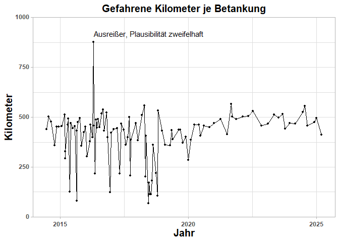
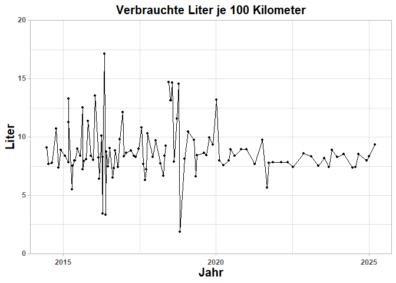
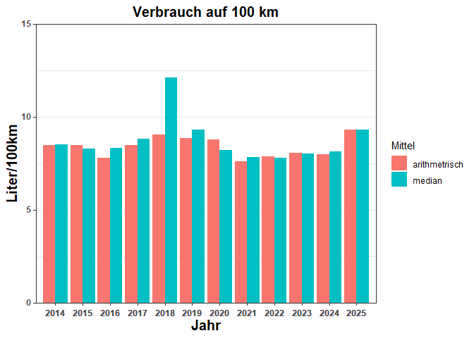
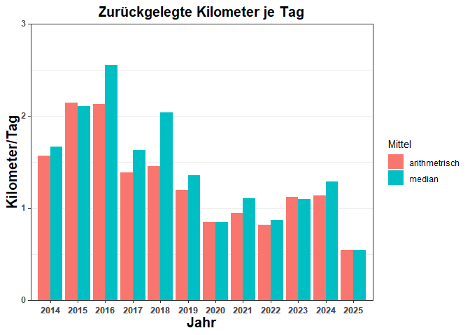
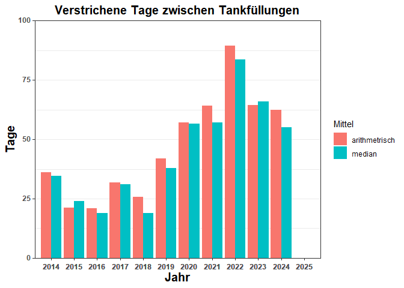
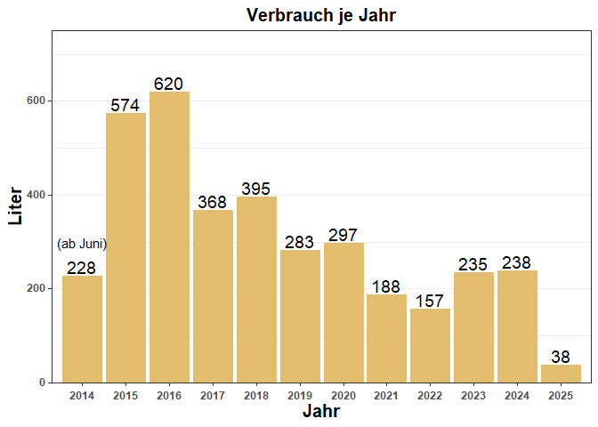

Tankstatistik
================
Bart R. Dutkiewicz
25.05.2025

## Tank- und Verbrauchsstatistik eines Toyota Corolla Bj. 1998 ab Juni 2014

In diesem Projekt wird die Tankstatistik eines Toyota Corolla Bj. 1998
seit 2014 fortlaufend ausgewertet. Das Auto wird durch den Urheber
dieser Auswertung überwiegend innerhalb der Region Stuttgart bewegt und
an städischen Tankstellen betankt (in sehr seltenen Fällen an der
Autobahn).

Dieses Projekt ist <b>Work-In-Progress</b> und der Datensatz wird
laufend ergänzt.</b> Die verwendete Version von R ist 4.5.2.

<b>Bei dem Auto handelt es sich um:</b>

- Hersteller: Toyota
- Modell: Corolla
- Erstzulassung: 10.06.1998
- Treibstoff: Benzin (E95)
- Tankvolumen: 40 Liter
- Leergewicht: 920kg
- Hubraum: 1587cm3
- Leistung: 81kw
- Max. Umdrehungen: 6000U/min
- Höchstgeschw.: 195km/h

<b>Folgende Daten werden anhand der Tankquittungen und Notizen/Photos
auf einem Mobiltelefon (Kilometerstände) erfasst:</b>

- Datum
- Uhrzeit
- Getankte Liter (E95)
- Literpreis
- Betrag in Euro
- Gefahrene Kilometer bis zur nächsten Betankung
- Kilometerstand
- Anmerkungen zu Rabatten an der Kasse, Ungenauigkeiten etc. (nicht
  abgebildet)

<b>Die folgende Analyse teilt sich in folgende Abschnitte auf:</b>

- <u>Datenaufbereitung:</u> die Rohdaten werden eingelesen und zur
  weiteren Verarbeitung vorbereitet. Lücken im Datensatz werden durch
  Schätzung auf Grundlage benachbarter Werte und durch Rückrechnung
  aufgefüllt. Zudem werden einige Quotienten berechnet.
- <u>Gesamtzeitraum:</u> es werden kumulierte Summen, arithmetrische
  Mittel und Mediane (wo aussagekräftig) über den gesamten Zeitraum
  berechnet und letzere beide miteinander verglichen.
- <u>Jährliche Auswertung:</u> selbiges für die Einzeljahre.
- <u>Abbildungen:</u> für einige Variablen werden die zeitlichen
  Verläufe mit allen Beobachtungen abgebildet. Zudem werden die
  Jahressummen und -mittelwerte abgebildet. Bei letzeren werden die
  beiden Mittel für jedes Jahr gegenübergestellt.
- <u>Data Story.</u>
- <u>Alle Quelltexte, Dateien und Lizenz</u>

<b> Hinweise:</b>

- Die Datenaufbereitung und -auswertung erfolgt ausschließlich mithilfe
  der R-Basispakete. Dies war eine Entscheidung aus autodidaktischen
  Gründen und wird so beibehalten. Für Abbildungen wird tidyverse
  verwendet.
- Die Ergebnisse werden in den Übersichten nicht interpretiert. Hierzu
  ist wurde die Data Story erstellt.
- In diesem Markdown-Dokument ist das Skript nur Teilweise einsehbar.
  Vollständige Quelltexte aller Varianten sind im Tab “Alle Quelltexte
  und Lizenz” verlinkt.

------------------------------------------------------------------------

### Datenaufbereitung

#### Der Rohdatensatz

    ##     Tag Monat Jahr Stunde Minute Liter Euro_Liter  Euro      km km_gesamt
    ## 1    NA    NA 2014     NA     NA 40.00         NA 60.00 440.200        NA
    ## 2    15     7 2014     NA     NA 38.59      1.569 60.55 503.200        NA
    ## 3    22     8 2014     NA     NA 37.23      1.559 58.04 478.500        NA
    ## 4    12    10 2014     NA     NA 38.38      1.489 57.15 358.700        NA
    ## 5     7    11 2014     NA     NA 33.29      1.439 47.90 450.900        NA
    ## 6     8    12 2014     NA     NA 40.12      1.389 55.73 451.500        NA
    ## 7    22     1 2015     NA     NA 38.00      1.290 49.02 454.500        NA
    ## 8     6     3 2015     NA     NA 40.24      1.419 57.10 513.100        NA
    ## 9     8     3 2015     16     28 38.90      1.419 55.20 293.200        NA
    ## 10   11     3 2015     16     46 37.09      1.449 37.09 329.000        NA
    ## 11   18     4 2015     NA     NA 25.42      1.439 36.58 463.400        NA
    ## 12   25     4 2015     13     42 37.23      1.419 52.83 493.400        NA
    ## 13   17     5 2015     NA     NA 10.00      1.439 14.29 125.000        NA
    ## 14   26     5 2015     NA     NA 37.47      1.449 54.30 470.800        NA
    ## 15   24     6 2015     NA     NA 40.00      1.439 57.56 444.800        NA
    ## 16   23     7 2015     NA     NA 38.17      1.439 57.22 454.000        NA
    ## 17   21     8 2015     NA     NA 10.01      1.424 14.25  79.900        NA
    ## 18   22     8 2015     NA     NA 31.30      1.338 41.89 432.800        NA
    ## 19    9     9 2015     19      9 37.72      1.339 50.51 474.700        NA
    ## 20    5    10 2015     NA     NA 40.03      1.279 51.20 495.900        NA
    ## 21   26    10 2015     14     25 40.56      1.279 51.88 356.500        NA
    ## 22   29    11 2015     11     16 35.61      1.319 46.97 425.000        NA
    ## 23   25    12 2015     13      8 36.18      1.279 46.27 451.300        NA
    ## 24   18     1 2016     23     33 41.05      1.299 53.32 302.900        NA
    ## 25   27     2 2016     11      7 31.23      1.219 38.07 378.600        NA
    ## 26    6     3 2016     21      0 29.65      1.159 34.36 462.400        NA
    ## 27    2     4 2016     12      8 40.47      1.279 51.76 400.500        NA
    ## 28   16     4 2016     16      5 29.99      1.229 36.86 877.200        NA
    ## 29   22     4 2016     19      5 37.98      1.229 46.68 458.000        NA
    ## 30   11     5 2016     11      6 36.97      1.269 46.91 215.700        NA
    ## 31   25     5 2016     22     16 16.12      1.279 20.62 487.500        NA
    ## 32    3     6 2016     15     28 39.21      1.329 52.11 447.700        NA
    ## 33   24     6 2016     16     33 36.64      1.309 47.96 490.400        NA
    ## 34   10     7 2016     16      8 40.68      1.309 53.25 450.000        NA
    ## 35   13     8 2016     23     58 33.74      1.329 44.84 518.600        NA
    ## 36    1     9 2016     16     30 39.49      1.269 49.72 539.050        NA
    ## 37   14     9 2016     17     34 38.11      1.289 49.12 432.200        NA
    ## 38   19    10 2016     17     28 38.91      1.309 50.93 522.400        NA
    ## 39    8    11 2016     16     36 39.10      1.289 50.40 398.550        NA
    ## 40   12    12 2016     22     30 15.00      1.509 22.64 124.000        NA
    ## 41   25    12 2016     12     42 35.26      1.419 50.03 422.600        NA
    ## 42   27     1 2017     17     46 38.04      1.339 50.56 440.100        NA
    ## 43   23     3 2017     12     57 39.24      1.339 52.54 443.500        NA
    ## 44   23     4 2017     15     50 18.13      1.379 25.00 216.000        NA
    ## 45   18     5 2017     20     35 38.53      1.319 50.82 466.400        NA
    ## 46   24     6 2017     17      5 39.13      1.279 50.05 435.850        NA
    ## 47   25     7 2017     18     19 38.86      1.309 50.87 360.000        NA
    ## 48   19     8 2017     19     19 30.72      1.279 39.29 399.500        NA
    ## 49    8     9 2017     15     18 31.67      1.379 43.67 500.900        NA
    ## 50   23     9 2017     15     19 15.02      1.329 19.96 207.350        NA
    ## 51    5    10 2017     19     32 39.74      1.289 51.22 386.650        NA
    ## 52    9    12 2017     12     30 38.83      1.299 50.44 469.150        NA
    ## 53   11     1 2018     20      4 37.18      1.149 51.11 383.000        NA
    ## 54    8     3 2018     21     30 39.45      1.159 49.67 511.100        NA
    ## 55   13     4 2018     17      2 37.18      1.339 49.78 559.000        NA
    ## 56   29     4 2018     13     36 17.02      1.469 25.00 203.090        NA
    ## 57    8     5 2018     21     11 37.53      1.379 51.75 406.600        NA
    ## 58    9     6 2018     13      5 30.90      1.519 46.94      NA        NA
    ## 59   16     6 2018     18     39 25.18      1.479 37.24      NA        NA
    ## 60    4     7 2018     23     13 15.00      1.439 21.59      NA        NA
    ## 61   16     7 2018     21     59 15.00      1.469 22.04      NA        NA
    ## 62   28     7 2018     18      0 26.54      1.459 38.72      NA        NA
    ## 63   16     8 2018     20     41 28.49      1.439 41.00      NA        NA
    ## 64   23     9 2018     15     35 25.36      1.509 38.27      NA        NA
    ## 65   16    10 2018     20     19 15.23      1.499 22.83      NA        NA
    ## 66   27    10 2018     15     32 10.00      1.589 15.89      NA        NA
    ## 67   22    12 2018     17     20 35.00      1.439 50.37 431.650        NA
    ## 68    1     2 2019     20     31 37.67      1.269 47.80 360.625        NA
    ## 69   14     4 2019     15     12 34.86      1.479 51.56 358.350        NA
    ## 70    4     5 2019     20     57 28.73      1.499 43.07 433.825        NA
    ## 71   20     5 2019     12     23 32.79      1.529 50.14 389.625        NA
    ## 72   14     8 2019     21      1 37.71      1.399 52.76 437.150        NA
    ## 73    7     9 2019     16     54 36.95      1.429 52.80 437.600        NA
    ## 74   12    10 2019     12     53 36.87      1.409 51.95 370.400        NA
    ## 75   22    11 2019     15     16 37.64      1.369 51.53 402.100        NA
    ## 76    2     1 2020     20     48 37.51      1.439 53.98 285.100    137912
    ## 77    7     2 2020     14     37 30.73      1.399 42.99 386.150    138298
    ## 78   29     3 2020     17      8 35.01      1.229 43.03 461.200    138759
    ## 79   30     5 2020     12      6 36.83      1.139 41.95 461.400    139221
    ## 80   23     6 2020      8     35 36.27      1.329 48.20 406.800    139628
    ## 81   10     8 2020     21      2 38.16      1.259 47.66 456.300    140084
    ## 82   30    10 2020     16     41 40.17      1.299 51.78 449.000    140533
    ## 83   31    12 2020     10     57 42.02      1.359 57.11 469.000    141002
    ## 84    3     4 2021     14     35 37.79      1.529 57.78 490.900    141493
    ## 85    8     7 2021     15     26 40.52      1.649 66.82 414.600    141908
    ## 86    3     9 2021     11     27 32.10      1.599 51.33 566.000    142474
    ## 87   20     9 2021     21     38 39.16      1.609 63.01 502.350    142976
    ## 88   12    11 2021     22     24 38.50      1.699 65.41 490.350    143466
    ## 89   18     2 2022     12      5 39.28      1.769 69.10 502.600    143968
    ## 90    4     5 2022     19      2 39.33      1.989 77.84 503.650    144472
    ## 91   10     7 2022     14     54 39.19      1.829 71.68 529.950    145002
    ## 92   11    11 2022     19     51 39.22      1.879 73.69 456.750    145459
    ## 93   11     2 2023     18      9 38.79      1.749 67.84 466.900    145926
    ## 94    8     5 2023     16     16 38.64      1.829 70.67 513.000    146439
    ## 95   14     7 2023     12     30 40.80      1.919 78.30 498.300    146937
    ## 96    7     9 2023     14     41 38.17      1.979 75.54 514.780    147452
    ## 97   13    10 2023     15     45 39.28      1.889 74.20 442.300    147894
    ## 98   17    12 2023     21     12 38.89      1.699 66.07 469.000    148363
    ## 99    3     3 2024     16     34 40.02      1.879 75.20 467.550    148831
    ## 100  17     6 2024     20      2 38.74      1.799 69.69 525.100    149356
    ## 101  20     7 2024      9     47 41.11      1.899 78.07 554.550    149910
    ## 102  27     8 2024     17      9 39.01      1.719 67.06 456.000    150366
    ## 103   2    12 2024     10     13 37.77      1.719 64.93 474.200    150840
    ## 104  31    12 2024     18     53 41.32      1.749 72.27 495.400    151336
    ## 105  13     3 2025      7     15 38.42      1.839 70.65 411.650    151747
    ## 106  21     7 2025     15     18 38.44      1.709 65.69 287.200    152034
    ## 107  23     9 2025     16     43 22.56      1.689 38.10 319.000    152353
    ## 108   2    11 2025     17     38 24.39      1.679 40.95 453.200    152807
    ## 109   9    11 2025     20     53 37.53      1.719 64.51 415.100    153222
    ## 110  17    11 2025      7      5 35.02      1.819 63.70      NA        NA

Es ist zu sehen, dass der Datensatz aufgrund von verlorenen oder
nicht-erhobenen Daten lückenhaft ist

#### Rekonstruktion, Teil 1

Im folgenden werden Tag und Monat durch Annahme rekonstruiert und der
Literpreis berechnet:

``` r
# Rekonstruktion von [1, 1]; [1, 2] (Tag und Monat)
df.raw[1, 1] <- 20; df.raw[1, 2] <- 6

# Rekonstruktion von [1, 7] (Literpreis)
df.raw[1, 7] <- df.raw[1, 8]/df.raw[1, 6]
```

#### Aufbereitung, Teil 1

Im Folgenden werden Tag, Monat, Jahr zu einer Datumsvariable
zusammengefasst und die Tagedifferenz zwischen zwei Betankungen
berechnet.

``` r
# Erzeugen einer Datumsvariable und Einfügen dieser 
# in die Tabelle.
Datum <- paste(df.raw$Jahr,"-",df.raw$Monat,"-",df.raw$Tag, sep="")
df.raw$Datum <- as.Date(Datum)

# Berechnen der vergangenen Tage zwischen zwei Betankungen
Tage <- as.integer(diff(df.raw$Datum))
df.raw$Tage <- c(Tage, NA)
```

#### Datenrekonstruktion, Teil 2

Für das Jahr 2018 sind einige Beobachtungen der mit einer Tankfüllung
zurückgelegten Kilometer verloren gegangen. Diese werden im Folgenden
anhand der durchschnittlichen Kilometerleistung je Tankfüllung aus dem
Jahr 2019 berechnet. Diese Näherung ist aufgrund ähnlichem
Fahrverhaltens in beiden Jahren plausibel.

``` r
## Rekonstruktion von [58, 9] bis [66, 9] (Kilometer je Tankfüllung in 2018)
# Durchschnittliche Kilometer am Tag 2019
df.raw.2019 <- subset(df.raw, Jahr == "2019")
df.raw.2019 <- df.raw.2019[, c(9, 12)]
Mittel.a.2019 <- lapply(df.raw.2019, function(x) mean(x))
Mittel.a.2019$km.Tag <- (Mittel.a.2019$km/Mittel.a.2019$Tage)

# Rückrechnung
df.raw[58, 9] <- df.raw[58, 12] * Mittel.a.2019$km.Tag
df.raw[59, 9] <- df.raw[59, 12] * Mittel.a.2019$km.Tag
df.raw[60, 9] <- df.raw[60, 12] * Mittel.a.2019$km.Tag
df.raw[61, 9] <- df.raw[61, 12] * Mittel.a.2019$km.Tag
df.raw[62, 9] <- df.raw[62, 12] * Mittel.a.2019$km.Tag
df.raw[63, 9] <- df.raw[63, 12] * Mittel.a.2019$km.Tag
df.raw[64, 9] <- df.raw[64, 12] * Mittel.a.2019$km.Tag
df.raw[65, 9] <- df.raw[65, 12] * Mittel.a.2019$km.Tag
df.raw[66, 9] <- df.raw[66, 12] * Mittel.a.2019$km.Tag
```

#### Datenrekonstruktion, Teil 3

Der Gesamtkilimeterstand wurde bis einschließlich 2019 nicht erhoben und
wird im Folgenden anhand der gefahrenen Kilometer je Tankfüllung
rückberechnet

``` r
# Rekonstruktion von [1, 10] bis [75, 10] (Gesamtkilometerstand)
for (i in 76:2){
  df.raw[i-1, 10] <- df.raw[i, 10] - df.raw[i, 9]
}
```

#### Aufbereitung, Teil 2

Die Rekonstruktion ist an dieser Stelle abgeschlossen. Im Folgenden
werden einige Hilfsobjekte aus dem Speicher entfernt, zwei Datenformate
geändert und Quotienten gebildet.

``` r
## Bereinigung Arbeitsumgebung
# Entfernen aller ab hier unnötigen Objekte
rm(df.raw.2019, Mittel.a.2019, Datum, i, Tage)


## Bilden einiger Quotienten
# Liter je km
df.raw$Liter.km <- df.raw$Liter / df.raw$km

# Euro je km
df.raw$Euro.km <- df.raw$Euro / df.raw$km

# Kilometer je Tag
df.raw$km.Tag <- df.raw$km / df.raw$Tage

# Liter je Tag
df.raw$Liter.Tag <- df.raw$Liter / df.raw$Tage

# Euro je Tag
df.raw$Euro.Tag <- df.raw$Euro / df.raw$Tage


## Format
# Tag und Monat als Ganzzahlen speichern
df.raw$Tag <- as.integer(df.raw$Tag)
df.raw$Monat <- as.integer(df.raw$Monat)
```

#### Aufbereitung, Teil 3

Im Folgenden werden alle Spalten gerundet.

Für die weitere Auswertung ist dies nicht zwingend nötig, aber das
Einlesen des exportierten, aufbereiteten Datensatzes in eine
SQL-Datenbank wird durch eine uneinheitliche Anzahl von Nachkommastellen
sehr erschwert (erzwingt unexaktes und speicherineffizentes
Zahlenformat).

Um dem zu begegnen, werden alle Spalten gerundet. Einige Distanz- und
Kostenspalten behalten dabei “ungewohnt” viele Nachkommastellen, weil
gröber gerundete Werte zu oft gleich zueinander sind.

``` r
# Runden aller Spalten für einheitliche Anzahl an Nachkommastellen
df.raw$km <- round(df.raw$km)
df.raw$km_gesamt <- round(df.raw$km_gesamt)
df.raw$Liter.km <- round(df.raw$Liter.km, 4)
df.raw$Euro.km <- round(df.raw$Euro.km, 4)
df.raw$km.Tag <- round(df.raw$km.Tag, 3)
df.raw$Liter.Tag <- round(df.raw$Liter.Tag, 4)
df.raw$Euro.Tag <- round(df.raw$Euro.Tag, 4)
```

#### Rekonstruierter Datensatz

    ##     Tag Monat Jahr Stunde Minute Liter Euro_Liter  Euro  km km_gesamt
    ## 1    20     6 2014     NA     NA 40.00      1.500 60.00 440    108823
    ## 2    15     7 2014     NA     NA 38.59      1.569 60.55 503    109326
    ## 3    22     8 2014     NA     NA 37.23      1.559 58.04 478    109804
    ## 4    12    10 2014     NA     NA 38.38      1.489 57.15 359    110163
    ## 5     7    11 2014     NA     NA 33.29      1.439 47.90 451    110614
    ## 6     8    12 2014     NA     NA 40.12      1.389 55.73 452    111066
    ## 7    22     1 2015     NA     NA 38.00      1.290 49.02 454    111520
    ## 8     6     3 2015     NA     NA 40.24      1.419 57.10 513    112033
    ## 9     8     3 2015     16     28 38.90      1.419 55.20 293    112326
    ## 10   11     3 2015     16     46 37.09      1.449 37.09 329    112655
    ## 11   18     4 2015     NA     NA 25.42      1.439 36.58 463    113119
    ## 12   25     4 2015     13     42 37.23      1.419 52.83 493    113612
    ## 13   17     5 2015     NA     NA 10.00      1.439 14.29 125    113737
    ## 14   26     5 2015     NA     NA 37.47      1.449 54.30 471    114208
    ## 15   24     6 2015     NA     NA 40.00      1.439 57.56 445    114653
    ## 16   23     7 2015     NA     NA 38.17      1.439 57.22 454    115107
    ## 17   21     8 2015     NA     NA 10.01      1.424 14.25  80    115187
    ## 18   22     8 2015     NA     NA 31.30      1.338 41.89 433    115619
    ## 19    9     9 2015     19      9 37.72      1.339 50.51 475    116094
    ## 20    5    10 2015     NA     NA 40.03      1.279 51.20 496    116590
    ## 21   26    10 2015     14     25 40.56      1.279 51.88 356    116947
    ## 22   29    11 2015     11     16 35.61      1.319 46.97 425    117372
    ## 23   25    12 2015     13      8 36.18      1.279 46.27 451    117823
    ## 24   18     1 2016     23     33 41.05      1.299 53.32 303    118126
    ## 25   27     2 2016     11      7 31.23      1.219 38.07 379    118504
    ## 26    6     3 2016     21      0 29.65      1.159 34.36 462    118967
    ## 27    2     4 2016     12      8 40.47      1.279 51.76 400    119367
    ## 28   16     4 2016     16      5 29.99      1.229 36.86 877    120244
    ## 29   22     4 2016     19      5 37.98      1.229 46.68 458    120702
    ## 30   11     5 2016     11      6 36.97      1.269 46.91 216    120918
    ## 31   25     5 2016     22     16 16.12      1.279 20.62 488    121406
    ## 32    3     6 2016     15     28 39.21      1.329 52.11 448    121853
    ## 33   24     6 2016     16     33 36.64      1.309 47.96 490    122344
    ## 34   10     7 2016     16      8 40.68      1.309 53.25 450    122794
    ## 35   13     8 2016     23     58 33.74      1.329 44.84 519    123312
    ## 36    1     9 2016     16     30 39.49      1.269 49.72 539    123851
    ## 37   14     9 2016     17     34 38.11      1.289 49.12 432    124284
    ## 38   19    10 2016     17     28 38.91      1.309 50.93 522    124806
    ## 39    8    11 2016     16     36 39.10      1.289 50.40 399    125205
    ## 40   12    12 2016     22     30 15.00      1.509 22.64 124    125329
    ## 41   25    12 2016     12     42 35.26      1.419 50.03 423    125751
    ## 42   27     1 2017     17     46 38.04      1.339 50.56 440    126191
    ## 43   23     3 2017     12     57 39.24      1.339 52.54 444    126635
    ## 44   23     4 2017     15     50 18.13      1.379 25.00 216    126851
    ## 45   18     5 2017     20     35 38.53      1.319 50.82 466    127317
    ## 46   24     6 2017     17      5 39.13      1.279 50.05 436    127753
    ## 47   25     7 2017     18     19 38.86      1.309 50.87 360    128113
    ## 48   19     8 2017     19     19 30.72      1.279 39.29 400    128513
    ## 49    8     9 2017     15     18 31.67      1.379 43.67 501    129013
    ## 50   23     9 2017     15     19 15.02      1.329 19.96 207    129221
    ## 51    5    10 2017     19     32 39.74      1.289 51.22 387    129607
    ## 52    9    12 2017     12     30 38.83      1.299 50.44 469    130077
    ## 53   11     1 2018     20      4 37.18      1.149 51.11 383    130460
    ## 54    8     3 2018     21     30 39.45      1.159 49.67 511    130971
    ## 55   13     4 2018     17      2 37.18      1.339 49.78 559    131530
    ## 56   29     4 2018     13     36 17.02      1.469 25.00 203    131733
    ## 57    8     5 2018     21     11 37.53      1.379 51.75 407    132139
    ## 58    9     6 2018     13      5 30.90      1.519 46.94  67    132206
    ## 59   16     6 2018     18     39 25.18      1.479 37.24 171    132377
    ## 60    4     7 2018     23     13 15.00      1.439 21.59 114    132492
    ## 61   16     7 2018     21     59 15.00      1.469 22.04 114    132606
    ## 62   28     7 2018     18      0 26.54      1.459 38.72 181    132787
    ## 63   16     8 2018     20     41 28.49      1.439 41.00 362    133149
    ## 64   23     9 2018     15     35 25.36      1.509 38.27 219    133368
    ## 65   16    10 2018     20     19 15.23      1.499 22.83 105    133472
    ## 66   27    10 2018     15     32 10.00      1.589 15.89 533    134006
    ## 67   22    12 2018     17     20 35.00      1.439 50.37 432    134437
    ## 68    1     2 2019     20     31 37.67      1.269 47.80 361    134798
    ## 69   14     4 2019     15     12 34.86      1.479 51.56 358    135156
    ## 70    4     5 2019     20     57 28.73      1.499 43.07 434    135590
    ## 71   20     5 2019     12     23 32.79      1.529 50.14 390    135980
    ## 72   14     8 2019     21      1 37.71      1.399 52.76 437    136417
    ## 73    7     9 2019     16     54 36.95      1.429 52.80 438    136854
    ## 74   12    10 2019     12     53 36.87      1.409 51.95 370    137225
    ## 75   22    11 2019     15     16 37.64      1.369 51.53 402    137627
    ## 76    2     1 2020     20     48 37.51      1.439 53.98 285    137912
    ## 77    7     2 2020     14     37 30.73      1.399 42.99 386    138298
    ## 78   29     3 2020     17      8 35.01      1.229 43.03 461    138759
    ## 79   30     5 2020     12      6 36.83      1.139 41.95 461    139221
    ## 80   23     6 2020      8     35 36.27      1.329 48.20 407    139628
    ## 81   10     8 2020     21      2 38.16      1.259 47.66 456    140084
    ## 82   30    10 2020     16     41 40.17      1.299 51.78 449    140533
    ## 83   31    12 2020     10     57 42.02      1.359 57.11 469    141002
    ## 84    3     4 2021     14     35 37.79      1.529 57.78 491    141493
    ## 85    8     7 2021     15     26 40.52      1.649 66.82 415    141908
    ## 86    3     9 2021     11     27 32.10      1.599 51.33 566    142474
    ## 87   20     9 2021     21     38 39.16      1.609 63.01 502    142976
    ## 88   12    11 2021     22     24 38.50      1.699 65.41 490    143466
    ## 89   18     2 2022     12      5 39.28      1.769 69.10 503    143968
    ## 90    4     5 2022     19      2 39.33      1.989 77.84 504    144472
    ## 91   10     7 2022     14     54 39.19      1.829 71.68 530    145002
    ## 92   11    11 2022     19     51 39.22      1.879 73.69 457    145459
    ## 93   11     2 2023     18      9 38.79      1.749 67.84 467    145926
    ## 94    8     5 2023     16     16 38.64      1.829 70.67 513    146439
    ## 95   14     7 2023     12     30 40.80      1.919 78.30 498    146937
    ## 96    7     9 2023     14     41 38.17      1.979 75.54 515    147452
    ## 97   13    10 2023     15     45 39.28      1.889 74.20 442    147894
    ## 98   17    12 2023     21     12 38.89      1.699 66.07 469    148363
    ## 99    3     3 2024     16     34 40.02      1.879 75.20 468    148831
    ## 100  17     6 2024     20      2 38.74      1.799 69.69 525    149356
    ## 101  20     7 2024      9     47 41.11      1.899 78.07 555    149910
    ## 102  27     8 2024     17      9 39.01      1.719 67.06 456    150366
    ## 103   2    12 2024     10     13 37.77      1.719 64.93 474    150840
    ## 104  31    12 2024     18     53 41.32      1.749 72.27 495    151336
    ## 105  13     3 2025      7     15 38.42      1.839 70.65 412    151747
    ## 106  21     7 2025     15     18 38.44      1.709 65.69 287    152034
    ## 107  23     9 2025     16     43 22.56      1.689 38.10 319    152353
    ## 108   2    11 2025     17     38 24.39      1.679 40.95 453    152807
    ## 109   9    11 2025     20     53 37.53      1.719 64.51 415    153222
    ## 110  17    11 2025      7      5 35.02      1.819 63.70  NA        NA
    ##          Datum Tage Liter.km Euro.km  km.Tag Liter.Tag Euro.Tag
    ## 1   2014-06-20   25   0.0909  0.1363  17.608    1.6000   2.4000
    ## 2   2014-07-15   38   0.0767  0.1203  13.242    1.0155   1.5934
    ## 3   2014-08-22   51   0.0778  0.1213   9.382    0.7300   1.1380
    ## 4   2014-10-12   26   0.1070  0.1593  13.796    1.4762   2.1981
    ## 5   2014-11-07   31   0.0738  0.1062  14.545    1.0739   1.5452
    ## 6   2014-12-08   45   0.0889  0.1234  10.033    0.8916   1.2384
    ## 7   2015-01-22   43   0.0836  0.1079  10.570    0.8837   1.1400
    ## 8   2015-03-06    2   0.0784  0.1113 256.550   20.1200  28.5500
    ## 9   2015-03-08    3   0.1327  0.1883  97.733   12.9667  18.4000
    ## 10  2015-03-11   38   0.1127  0.1127   8.658    0.9761   0.9761
    ## 11  2015-04-18    7   0.0549  0.0789  66.200    3.6314   5.2257
    ## 12  2015-04-25   22   0.0755  0.1071  22.427    1.6923   2.4014
    ## 13  2015-05-17    9   0.0800  0.1143  13.889    1.1111   1.5878
    ## 14  2015-05-26   29   0.0796  0.1153  16.234    1.2921   1.8724
    ## 15  2015-06-24   29   0.0899  0.1294  15.338    1.3793   1.9848
    ## 16  2015-07-23   29   0.0841  0.1260  15.655    1.3162   1.9731
    ## 17  2015-08-21    1   0.1253  0.1783  79.900   10.0100  14.2500
    ## 18  2015-08-22   18   0.0723  0.0968  24.044    1.7389   2.3272
    ## 19  2015-09-09   26   0.0795  0.1064  18.258    1.4508   1.9427
    ## 20  2015-10-05   21   0.0807  0.1032  23.614    1.9062   2.4381
    ## 21  2015-10-26   34   0.1138  0.1455  10.485    1.1929   1.5259
    ## 22  2015-11-29   26   0.0838  0.1105  16.346    1.3696   1.8065
    ## 23  2015-12-25   24   0.0802  0.1025  18.804    1.5075   1.9279
    ## 24  2016-01-18   40   0.1355  0.1760   7.572    1.0262   1.3330
    ## 25  2016-02-27    8   0.0825  0.1006  47.325    3.9038   4.7588
    ## 26  2016-03-06   27   0.0641  0.0743  17.126    1.0981   1.2726
    ## 27  2016-04-02   14   0.1010  0.1292  28.607    2.8907   3.6971
    ## 28  2016-04-16    6   0.0342  0.0420 146.200    4.9983   6.1433
    ## 29  2016-04-22   19   0.0829  0.1019  24.105    1.9989   2.4568
    ## 30  2016-05-11   14   0.1714  0.2175  15.407    2.6407   3.3507
    ## 31  2016-05-25    9   0.0331  0.0423  54.167    1.7911   2.2911
    ## 32  2016-06-03   21   0.0876  0.1164  21.319    1.8671   2.4814
    ## 33  2016-06-24   16   0.0747  0.0978  30.650    2.2900   2.9975
    ## 34  2016-07-10   34   0.0904  0.1183  13.235    1.1965   1.5662
    ## 35  2016-08-13   19   0.0651  0.0865  27.295    1.7758   2.3600
    ## 36  2016-09-01   13   0.0733  0.0922  41.465    3.0377   3.8246
    ## 37  2016-09-14   35   0.0882  0.1137  12.349    1.0889   1.4034
    ## 38  2016-10-19   20   0.0745  0.0975  26.120    1.9455   2.5465
    ## 39  2016-11-08   34   0.0981  0.1265  11.722    1.1500   1.4824
    ## 40  2016-12-12   13   0.1210  0.1826   9.538    1.1538   1.7415
    ## 41  2016-12-25   33   0.0834  0.1184  12.806    1.0685   1.5161
    ## 42  2017-01-27   55   0.0864  0.1149   8.002    0.6916   0.9193
    ## 43  2017-03-23   31   0.0885  0.1185  14.306    1.2658   1.6948
    ## 44  2017-04-23   25   0.0839  0.1157   8.640    0.7252   1.0000
    ## 45  2017-05-18   37   0.0826  0.1090  12.605    1.0414   1.3735
    ## 46  2017-06-24   31   0.0898  0.1148  14.060    1.2623   1.6145
    ## 47  2017-07-25   25   0.1079  0.1413  14.400    1.5544   2.0348
    ## 48  2017-08-19   20   0.0769  0.0983  19.975    1.5360   1.9645
    ## 49  2017-09-08   15   0.0632  0.0872  33.393    2.1113   2.9113
    ## 50  2017-09-23   12   0.0724  0.0963  17.279    1.2517   1.6633
    ## 51  2017-10-05   65   0.1028  0.1325   5.948    0.6114   0.7880
    ## 52  2017-12-09   33   0.0828  0.1075  14.217    1.1767   1.5285
    ## 53  2018-01-11   56   0.0971  0.1334   6.839    0.6639   0.9127
    ## 54  2018-03-08   36   0.0772  0.0972  14.197    1.0958   1.3797
    ## 55  2018-04-13   16   0.0665  0.0891  34.938    2.3238   3.1112
    ## 56  2018-04-29    9   0.0838  0.1231  22.566    1.8911   2.7778
    ## 57  2018-05-08   32   0.0923  0.1273  12.706    1.1728   1.6172
    ## 58  2018-06-09    7   0.4636  0.7043   9.521    4.4143   6.7057
    ## 59  2018-06-16   18   0.1469  0.2173   9.521    1.3989   2.0689
    ## 60  2018-07-04   12   0.1313  0.1890   9.521    1.2500   1.7992
    ## 61  2018-07-16   12   0.1313  0.1929   9.521    1.2500   1.8367
    ## 62  2018-07-28   19   0.1467  0.2140   9.521    1.3968   2.0379
    ## 63  2018-08-16   38   0.0787  0.1133   9.521    0.7497   1.0789
    ## 64  2018-09-23   23   0.1158  0.1748   9.521    1.1026   1.6639
    ## 65  2018-10-16   11   0.1454  0.2180   9.521    1.3845   2.0755
    ## 66  2018-10-27   56   0.0188  0.0298   9.521    0.1786   0.2838
    ## 67  2018-12-22   41   0.0811  0.1167  10.528    0.8537   1.2285
    ## 68  2019-02-01   72   0.1045  0.1325   5.009    0.5232   0.6639
    ## 69  2019-04-14   20   0.0973  0.1439  17.918    1.7430   2.5780
    ## 70  2019-05-04   16   0.0662  0.0993  27.114    1.7956   2.6919
    ## 71  2019-05-20   86   0.0842  0.1287   4.531    0.3813   0.5830
    ## 72  2019-08-14   24   0.0863  0.1207  18.215    1.5713   2.1983
    ## 73  2019-09-07   35   0.0844  0.1207  12.503    1.0557   1.5086
    ## 74  2019-10-12   41   0.0995  0.1403   9.034    0.8993   1.2671
    ## 75  2019-11-22   41   0.0936  0.1282   9.807    0.9180   1.2568
    ## 76  2020-01-02   36   0.1316  0.1893   7.919    1.0419   1.4994
    ## 77  2020-02-07   51   0.0796  0.1113   7.572    0.6025   0.8429
    ## 78  2020-03-29   62   0.0759  0.0933   7.439    0.5647   0.6940
    ## 79  2020-05-30   24   0.0798  0.0909  19.225    1.5346   1.7479
    ## 80  2020-06-23   48   0.0892  0.1185   8.475    0.7556   1.0042
    ## 81  2020-08-10   81   0.0836  0.1044   5.633    0.4711   0.5884
    ## 82  2020-10-30   62   0.0895  0.1153   7.242    0.6479   0.8352
    ## 83  2020-12-31   93   0.0896  0.1218   5.043    0.4518   0.6141
    ## 84  2021-04-03   96   0.0770  0.1177   5.114    0.3936   0.6019
    ## 85  2021-07-08   57   0.0977  0.1612   7.274    0.7109   1.1723
    ## 86  2021-09-03   17   0.0567  0.0907  33.294    1.8882   3.0194
    ## 87  2021-09-20   53   0.0780  0.1254   9.478    0.7389   1.1889
    ## 88  2021-11-12   98   0.0785  0.1334   5.004    0.3929   0.6674
    ## 89  2022-02-18   75   0.0782  0.1375   6.701    0.5237   0.9213
    ## 90  2022-05-04   67   0.0781  0.1546   7.517    0.5870   1.1618
    ## 91  2022-07-10  124   0.0740  0.1353   4.274    0.3160   0.5781
    ## 92  2022-11-11   92   0.0859  0.1613   4.965    0.4263   0.8010
    ## 93  2023-02-11   86   0.0831  0.1453   5.429    0.4510   0.7888
    ## 94  2023-05-08   67   0.0753  0.1378   7.657    0.5767   1.0548
    ## 95  2023-07-14   55   0.0819  0.1571   9.060    0.7418   1.4236
    ## 96  2023-09-07   36   0.0741  0.1467  14.299    1.0603   2.0983
    ## 97  2023-10-13   65   0.0888  0.1678   6.805    0.6043   1.1415
    ## 98  2023-12-17   77   0.0829  0.1409   6.091    0.5051   0.8581
    ## 99  2024-03-03  106   0.0856  0.1608   4.411    0.3775   0.7094
    ## 100 2024-06-17   33   0.0738  0.1327  15.912    1.1739   2.1118
    ## 101 2024-07-20   38   0.0741  0.1408  14.593    1.0818   2.0545
    ## 102 2024-08-27   97   0.0855  0.1471   4.701    0.4022   0.6913
    ## 103 2024-12-02   29   0.0796  0.1369  16.352    1.3024   2.2390
    ## 104 2024-12-31   72   0.0834  0.1459   6.881    0.5739   1.0037
    ## 105 2025-03-13  130   0.0933  0.1716   3.167    0.2955   0.5435
    ## 106 2025-07-21   64   0.1338  0.2287   4.487    0.6006   1.0264
    ## 107 2025-09-23   40   0.0707  0.1194   7.975    0.5640   0.9525
    ## 108 2025-11-02    7   0.0538  0.0904  64.743    3.4843   5.8500
    ## 109 2025-11-09    8   0.0904  0.1554  51.888    4.6912   8.0638
    ## 110 2025-11-17   NA       NA      NA      NA        NA       NA

#### Datenstruktur des rekonstruierten Datensatzes

``` r
str(df.raw)
```

    ## 'data.frame':    110 obs. of  17 variables:
    ##  $ Tag       : int  20 15 22 12 7 8 22 6 8 11 ...
    ##  $ Monat     : int  6 7 8 10 11 12 1 3 3 3 ...
    ##  $ Jahr      : int  2014 2014 2014 2014 2014 2014 2015 2015 2015 2015 ...
    ##  $ Stunde    : int  NA NA NA NA NA NA NA NA 16 16 ...
    ##  $ Minute    : int  NA NA NA NA NA NA NA NA 28 46 ...
    ##  $ Liter     : num  40 38.6 37.2 38.4 33.3 ...
    ##  $ Euro_Liter: num  1.5 1.57 1.56 1.49 1.44 ...
    ##  $ Euro      : num  60 60.5 58 57.1 47.9 ...
    ##  $ km        : num  440 503 478 359 451 452 454 513 293 329 ...
    ##  $ km_gesamt : num  108823 109326 109804 110163 110614 ...
    ##  $ Datum     : Date, format: "2014-06-20" "2014-07-15" ...
    ##  $ Tage      : int  25 38 51 26 31 45 43 2 3 38 ...
    ##  $ Liter.km  : num  0.0909 0.0767 0.0778 0.107 0.0738 ...
    ##  $ Euro.km   : num  0.136 0.12 0.121 0.159 0.106 ...
    ##  $ km.Tag    : num  17.61 13.24 9.38 13.8 14.54 ...
    ##  $ Liter.Tag : num  1.6 1.02 0.73 1.48 1.07 ...
    ##  $ Euro.Tag  : num  2.4 1.59 1.14 2.2 1.55 ...

#### Datensatzvarianten erzeugen

Trennung des Datensatzes in eine Exportvariante und eine
Auswertungsvariante. Die unvollständige jüngste Beobachtung wird für die
weitere Auswertung nicht berücksichtigt und aus dem Auswertungsdatensatz
entfernt. Für die Exportvariante werden die in R üblichen Punkte in den
Spaltennamen durch Unterstriche ersetzt, da erstere z.B. in SQL und
Python Probleme verursachen.

``` r
## Aufbereiteter Datensatz inkl. unv. jüngster Beobachtung für den Export
df.export <- df.raw

# In Spaltennamen Punkt durch Unterstrich ersetzen
names(df.export) <- gsub(x = names(df.export), pattern = "\\.", replacement = "_")
#Punkte in Spaltennamen sind in R üblich, jedoch in anderen Werkzeugen wie Python problematisch.


## Aufbereiteter Datensatz exkl. unv. jüngster Beobachtung für die weitere Auswertung
df.raw <- df.raw[-nrow(df.raw), ]
df <- df.raw
rm(df.raw)
```

#### Berechnung der Summen und Mittel über den Gesamtzeitraum und die Einzeljahre

Der Code zur Auswertung wird hier aufgrund großer Länge und
Repetitivität ausgelassen und ist im grundliegenden Skript auf GitHub
und Posit.Cloud zu Verfügung gestellt.

### Gesamtzeitraum

#### Summen der seit Beginn der Erhebung am 20.06.2014:

| Liter | Euro |    km | Tage | Betankungen |
|------:|-----:|------:|-----:|------------:|
|  3743 | 5484 | 44840 | 4168 |         109 |

Gesamtsummen seit Juni 2014

#### Mittel über den gesamten Zeitraum je Betankung

In den linken Spalten sind arithmetrisches Mittel und Median von:

- Getanke Liter
- Preis in Euro je Liter
- Gezahlte Summe in Euro
- Zurückgelegte Kilometer bis zur nächten Betankung
- Verstrichene Tage bis zur nächsten Betankung
- Verbrauchte Liter je Kilometer
- Kosten in Euro je Kilometer
- Zurückgelegte Kilometer je Tag
- Verbrauchte Liter je Tag
- Kosten in Euro je Tag
- Betankungen je Jahr

In den zwei rechten Spalten sind:

- Absolute Differenzen zwischen Median (Minuend) und arithmetrischem
  Mittel (Subtrahend)
- Relative Differenzen von selbigem

|            | Arith. Mittel | Median | Absolute Differenz | Prozentuale Differenz |
|:-----------|--------------:|-------:|-------------------:|----------------------:|
| Liter      |         34.34 |  37.71 |               3.37 |                  8.94 |
| Euro_Liter |          1.46 |   1.42 |              -0.04 |                 -2.73 |
| Euro       |         50.32 |  50.87 |               0.55 |                  1.09 |
| km         |        411.38 | 445.00 |              33.62 |                  7.56 |
| Tage       |         38.24 |  32.00 |              -6.24 |                -19.50 |
| Liter.km   |          0.08 |   0.08 |               0.00 |                  1.50 |
| Euro.km    |          0.12 |   0.11 |              -0.01 |                 -7.00 |
| km.Tag     |         10.76 |  13.91 |               3.15 |                 22.64 |
| Liter.Tag  |          0.90 |   1.18 |               0.28 |                 23.79 |
| Euro.Tag   |          1.32 |   1.59 |               0.27 |                 17.23 |

Gesamtmittel

### Jährliche Auswertung

#### Jahressummen\*:

|      | Liter | Euro |   km | Betankungen |
|:-----|------:|-----:|-----:|------------:|
| 2014 |   228 |  339 | 2683 |           6 |
| 2015 |   574 |  774 | 6756 |          17 |
| 2016 |   620 |  800 | 7929 |          18 |
| 2017 |   368 |  484 | 4326 |          11 |
| 2018 |   395 |  562 | 4361 |          15 |
| 2019 |   283 |  402 | 3190 |           8 |
| 2020 |   297 |  387 | 3374 |           8 |
| 2021 |   188 |  304 | 2464 |           5 |
| 2022 |   157 |  292 | 1994 |           4 |
| 2023 |   235 |  433 | 2904 |           6 |
| 2024 |   238 |  427 | 2973 |           6 |
| 2025 |   161 |  280 | 1886 |           5 |

Jahressummen

\*Im Jahr 2014 ist nur die zweite Jahreshälfte erhoben

#### Jahresmittel

- Getanke Liter
- Preis in Euro je Liter
- Gezahlte Summe in Euro
- Zurückgelegte Kilometer bis zur nächten Betankung
- Verstrichene Tage bis zur nächsten Betankung
- Verbrauchte Liter je Kilometer
- Kosten in Euro je Kilometer
- Zurückgelegte Kilometer je Tag
- Verbrauchte Liter je Tag
- Kosten in Euro je Tag

#### Arithmetrische Mittel

|  | Liter | Euro/Liter | Euro | km | Tage | Liter/km | Euro/km | km/Tag | Liter/Tag | Euro/Tag |
|:---|---:|---:|---:|---:|---:|---:|---:|---:|---:|---:|
| 2014 | 37.94 | 1.49 | 56.56 | 447.17 | 36.00 | 0.08 | 0.13 | 1.57 | 1.05 | 1.57 |
| 2015 | 33.76 | 1.38 | 45.54 | 397.41 | 21.24 | 0.08 | 0.11 | 2.14 | 1.59 | 2.14 |
| 2016 | 34.42 | 1.30 | 44.42 | 440.50 | 20.83 | 0.08 | 0.10 | 2.13 | 1.65 | 2.13 |
| 2017 | 33.45 | 1.32 | 44.04 | 393.27 | 31.73 | 0.09 | 0.11 | 1.39 | 1.05 | 1.39 |
| 2018 | 26.34 | 1.42 | 37.48 | 290.73 | 25.73 | 0.09 | 0.13 | 1.46 | 1.02 | 1.46 |
| 2019 | 35.40 | 1.42 | 50.20 | 398.75 | 41.88 | 0.09 | 0.13 | 1.20 | 0.85 | 1.20 |
| 2020 | 37.09 | 1.31 | 48.34 | 421.75 | 57.12 | 0.09 | 0.11 | 0.85 | 0.65 | 0.85 |
| 2021 | 37.61 | 1.62 | 60.87 | 492.80 | 64.20 | 0.08 | 0.12 | 0.95 | 0.59 | 0.95 |
| 2022 | 39.25 | 1.87 | 73.08 | 498.50 | 89.50 | 0.08 | 0.15 | 0.82 | 0.44 | 0.82 |
| 2023 | 39.09 | 1.84 | 72.10 | 484.00 | 64.33 | 0.08 | 0.15 | 1.12 | 0.61 | 1.12 |
| 2024 | 39.66 | 1.79 | 71.20 | 495.50 | 62.50 | 0.08 | 0.14 | 1.14 | 0.63 | 1.14 |
| 2025 | 32.27 | 1.73 | 55.98 | 377.20 | 49.80 | 0.09 | 0.15 | 1.12 | 0.65 | 1.12 |

Jahresmittel (arithmetrisch)

#### Mediane

|      | Liter | Euro/Liter |  Euro |    km | Tage | Liter/km | Euro/km | km/Tag | Liter/Tag | Euro/Tag |
|:-----|------:|-----------:|------:|------:|-----:|---------:|--------:|-------:|----------:|---------:|
| 2014 | 38.48 |       1.49 | 57.59 | 451.5 | 34.5 |     0.09 |    0.13 |   1.67 |      1.12 |     1.67 |
| 2015 | 37.47 |       1.42 | 50.51 | 451.0 | 24.0 |     0.08 |    0.11 |   2.10 |      1.56 |     2.10 |
| 2016 | 37.47 |       1.29 | 48.54 | 449.0 | 19.0 |     0.08 |    0.11 |   2.55 |      1.97 |     2.55 |
| 2017 | 38.53 |       1.32 | 50.44 | 436.0 | 31.0 |     0.09 |    0.12 |   1.63 |      1.24 |     1.63 |
| 2018 | 26.54 |       1.46 | 38.72 | 219.0 | 19.0 |     0.12 |    0.18 |   2.04 |      1.40 |     2.04 |
| 2019 | 36.91 |       1.42 | 51.55 | 396.0 | 38.0 |     0.09 |    0.13 |   1.36 |      0.97 |     1.36 |
| 2020 | 37.17 |       1.31 | 47.93 | 452.5 | 56.5 |     0.08 |    0.11 |   0.85 |      0.66 |     0.85 |
| 2021 | 38.50 |       1.61 | 63.01 | 491.0 | 57.0 |     0.08 |    0.13 |   1.11 |      0.68 |     1.11 |
| 2022 | 39.25 |       1.85 | 72.68 | 503.5 | 83.5 |     0.08 |    0.14 |   0.87 |      0.47 |     0.87 |
| 2023 | 38.84 |       1.86 | 72.44 | 483.5 | 66.0 |     0.08 |    0.15 |   1.10 |      0.59 |     1.10 |
| 2024 | 39.52 |       1.77 | 70.98 | 484.5 | 55.0 |     0.08 |    0.15 |   1.29 |      0.72 |     1.29 |
| 2025 | 37.53 |       1.71 | 64.51 | 412.0 | 40.0 |     0.09 |    0.16 |   1.61 |      0.94 |     1.61 |

Jahresmittel (median)

#### Absolute Differenz zwischen Median (Minuend) und arithmetrischem Mittel (Subtrahend) in den Einzeljahren

|  | Liter | Euro/Liter | Euro | km | Tage | Liter/km | Euro/km | km/Tag | Liter/Tag | Euro/Tag |
|:---|---:|---:|---:|---:|---:|---:|---:|---:|---:|---:|
| 2014 | 0.55 | 0.00 | 1.03 | 4.33 | -1.50 | 0.00 | 0.00 | 0.10 | 0.06 | 0.10 |
| 2015 | 3.71 | 0.04 | 4.97 | 53.59 | 2.76 | 0.00 | 0.00 | -0.04 | -0.03 | -0.04 |
| 2016 | 3.05 | -0.01 | 4.12 | 8.50 | -1.83 | 0.01 | 0.01 | 0.42 | 0.32 | 0.42 |
| 2017 | 5.08 | 0.00 | 6.40 | 42.73 | -0.73 | 0.00 | 0.00 | 0.24 | 0.19 | 0.24 |
| 2018 | 0.20 | 0.04 | 1.24 | -71.73 | -6.73 | 0.03 | 0.05 | 0.58 | 0.37 | 0.58 |
| 2019 | 1.51 | 0.00 | 1.34 | -2.75 | -3.88 | 0.00 | 0.00 | 0.16 | 0.13 | 0.16 |
| 2020 | 0.08 | 0.01 | -0.41 | 30.75 | -0.62 | -0.01 | -0.01 | 0.00 | 0.01 | 0.00 |
| 2021 | 0.89 | -0.01 | 2.14 | -1.80 | -7.20 | 0.00 | 0.00 | 0.16 | 0.09 | 0.16 |
| 2022 | 0.00 | -0.01 | -0.39 | 5.00 | -6.00 | 0.00 | 0.00 | 0.05 | 0.03 | 0.05 |
| 2023 | -0.25 | 0.01 | 0.33 | -0.50 | 1.67 | 0.00 | 0.00 | -0.02 | -0.02 | -0.02 |
| 2024 | -0.15 | -0.02 | -0.22 | -11.00 | -7.50 | 0.00 | 0.00 | 0.15 | 0.08 | 0.15 |
| 2025 | 5.26 | -0.02 | 8.53 | 34.80 | -9.80 | 0.01 | 0.01 | 0.49 | 0.29 | 0.49 |

Absolute Differenz Median - Arith. Mittel

#### Prozentuale Differenz zwischen Median (Minuend) und arithmetrischem Mittel (Subtrahend) in den Einzeljahren

|  | Liter | Euro/Liter | Euro | km | Tage | Liter/km | Euro/km | km/Tag | Liter/Tag | Euro/Tag |
|:---|---:|---:|---:|---:|---:|---:|---:|---:|---:|---:|
| 2014 | 1.43 | 0.25 | 1.79 | 0.96 | -4.35 | 0.47 | 0.84 | 5.89 | 5.54 | 5.89 |
| 2015 | 9.90 | 2.76 | 9.84 | 11.88 | 11.52 | -2.25 | -2.32 | -1.90 | -1.83 | -1.90 |
| 2016 | 8.15 | -0.52 | 8.49 | 1.89 | -9.65 | 6.37 | 6.72 | 16.54 | 16.23 | 16.54 |
| 2017 | 13.19 | -0.21 | 12.69 | 9.80 | -2.35 | 3.76 | 3.21 | 14.69 | 15.18 | 14.69 |
| 2018 | 0.76 | 2.51 | 3.20 | -32.75 | -35.44 | 25.25 | 27.09 | 28.53 | 26.73 | 28.53 |
| 2019 | 4.08 | -0.26 | 2.61 | -0.69 | -10.20 | 4.75 | 3.28 | 11.62 | 12.96 | 11.62 |
| 2020 | 0.22 | 0.57 | -0.85 | 6.80 | -1.11 | -7.05 | -8.20 | 0.25 | 1.31 | 0.25 |
| 2021 | 2.30 | -0.50 | 3.40 | -0.37 | -12.63 | 2.66 | 3.75 | 14.23 | 13.26 | 14.23 |
| 2022 | -0.01 | -0.67 | -0.54 | 0.99 | -7.19 | -1.02 | -1.55 | 6.20 | 6.69 | 6.20 |
| 2023 | -0.66 | 0.81 | 0.46 | -0.10 | 2.53 | -0.55 | 0.56 | -2.12 | -3.26 | -2.12 |
| 2024 | -0.37 | -1.13 | -0.31 | -2.27 | -13.64 | 1.86 | 1.91 | 11.72 | 11.67 | 11.72 |
| 2025 | 14.02 | -1.05 | 13.22 | 8.45 | -24.50 | 6.09 | 5.22 | 30.30 | 30.94 | 30.30 |

Relative Differenz Median - Arith. Mittel in Prozent

### Abbildungen

#### Vorarbeit

(Pakete werden an dieser Stelle geladen)

``` r
# Pakete laden
library(tidyverse)
```

    ## ── Attaching core tidyverse packages ──────────────────────── tidyverse 2.0.0 ──
    ## ✔ dplyr     1.1.4     ✔ readr     2.1.5
    ## ✔ forcats   1.0.0     ✔ stringr   1.5.1
    ## ✔ ggplot2   3.5.2     ✔ tibble    3.3.0
    ## ✔ lubridate 1.9.4     ✔ tidyr     1.3.1
    ## ✔ purrr     1.1.0     
    ## ── Conflicts ────────────────────────────────────────── tidyverse_conflicts() ──
    ## ✖ dplyr::filter() masks stats::filter()
    ## ✖ dplyr::lag()    masks stats::lag()
    ## ℹ Use the conflicted package (<http://conflicted.r-lib.org/>) to force all conflicts to become errors

``` r
library(wesanderson) #Farbpaletten
```

``` r
## Vorarbeit
# Jahre (bisher als Zeilennamen) in reguläre Variable packen (damit ggplot2 zurecht kommt)
Summen.Jahr$Jahr <- as.integer(rownames(Summen.Jahr))
# Alles auf ganze Zahlen Runden (sonst hässliche Darstellung)
Summen.Jahr <- round(Summen.Jahr, digits = 0)
# Data Frame als Tibble
df <- as_tibble(df)

# Jahresmittelwerte in brauchbare Form bringen und zusammenführen
long.Mittel.Jahr.a <- Mittel.Jahr.a
names(long.Mittel.Jahr.a) <- str_sub(names(long.Mittel.Jahr.a), 1, nchar(names(long.Mittel.Jahr.a))-2) #Letzte beide Zeichen in den Spaltennamen Entfernen
long.Mittel.Jahr.a$Jahr <- as.integer(rownames(long.Mittel.Jahr.a)) #Jahr in Spalte ziehen
long.Mittel.Jahr.a$Mittel <- rep("arithmetrisch", nrow(long.Mittel.Jahr.a)) #Mittel in Spalte hinzufügen

long.Mittel.Jahr.m <- Mittel.Jahr.m
names(long.Mittel.Jahr.m) <- str_sub(names(long.Mittel.Jahr.m), 1, nchar(names(long.Mittel.Jahr.m))-2) #Das Gleiche für den Median
long.Mittel.Jahr.m$Jahr <- as.integer(rownames(long.Mittel.Jahr.m))
long.Mittel.Jahr.m$Mittel <- rep("median", nrow(long.Mittel.Jahr.m))

Mittel.Jahr <- rbind(long.Mittel.Jahr.a, long.Mittel.Jahr.m) #Zusammenführen
rownames(Mittel.Jahr) <- NULL #Zeilennamen löschen
Mittel.Jahr <- as_tibble(Mittel.Jahr) #In Tibble umwandeln


## Bereinigung Arbeitsumgebung
# Entfernen aller ab hier unnötigen Objekte
rm(long.Mittel.Jahr.a, long.Mittel.Jahr.m)
```

#### Jahressummen

<!-- -->

<!-- -->

<!-- -->

<!-- -->

#### Verläufe

<!-- -->

<!-- -->

<!-- -->

<!-- -->

<!-- -->

#### TBD: Kilometer je Tag und zeitlicher Abstand zur nächsten Betankung

#### TBD: Reichweite je Tank + Farbskala Abstand je Betankung

#### Jahresmittel (artithmetrisch und median)

<!-- -->

<!-- -->

<!-- -->

<!-- -->

<!-- -->

<!-- -->

<!-- -->

<!-- -->

<!-- -->

<!-- -->

### Data Story

#### Einleitung

In den vorangegangenen Tabs wurden die beschreibenden Statistiken und
Abbildungen weitestgehend ohne Kommentar und Interpretation präsentiert.
Im Folgenden wird eine kleine Tour durch die interessantesten Einglicke
dieses Datensatzes gegeben.

#### 

Zunächst wird ein Blick auf die akkumulierten Werte geworfen.

| Liter | Euro |    km | Tage | Betankungen |
|------:|-----:|------:|-----:|------------:|
|  3743 | 5484 | 44840 | 4168 |         109 |

Gesamtsummen seit Juni 2014

Die Summen von zurückgelegten Kilometern und den damit Zusammenhängenden
Kosten lassen im Bezug auf die verstrichene Zeit auf eine nur
sporadische Nutzung des Autos annehmen. Aber lassen sich im Verlauf der
Erhebung Änderungen in der Fahrzeugnutzung feststellen?

#### Lebenswandel und Fahrzeugnutzung

Das Auto befindet sich im Besitz der gleichen Person, welche von Beginn
der Erhebung bis August 2020 in einem Zweipersonenhaushalt lebte und
seit September 2021 in einem Einpersonenhaushalt lebt. Mit diesem Wandel
ging ein Wandel im Fahrverhalten einher: so entfielen einige längere
semi-regelmäßige Wegstrecken, und vor allem wird das Auto nur noch
sporadisch für Einkäufe verwedet, da Einkäufe seitdem vor allem zu Fuß
stattfinden.

<b>Schlägt sich dieser Wandel auch in der Statistik wieder?</b>

#### Relativer Benzinverbrauch

Auf Einkaufsfahren wurden bis 2020 Strecken von weniger als 5 km,
bisweilen weniger als 1 km. Diese sind bei Verbrennermotoren aus
technischen Gründen am verbrauchsstärksten. Aufgrund des Lebenswandels
finden solche Fahren kaum noch statt. Schlägt sich dies aber auch in der
Statistik nieder? Hierzu werden die je Tankfüllung (die Höchstkapazität
beträgt 40 Liter) zurückgelegten, Kilometer und dessen geläufigerer
Kehrwert (außerdem um zwei Stellen verschoben), der Literverbrauch auf
100 Kilometer näher betrachtet:

<!-- -->

Zunächst fällt ein enormer Ausreißer im Jahr 2016 auf, welcher bei 877,2
km zwischen zwei liegt, wesentlich über dem zweithöchsten je gemessenen
Wert von 566km zwischen zwei Betankungen und dem Median über die gesamte
Erhebungszeit von unter 500 km liegt. Dieser Wert ist gänzlich
unplausibel und am ehesten ein Tippfehler (wohlmöglich müsste es
stattdessen 577,2 km heißen. Dies wäre jedoch auch dann noch der
Spitenwert). Für die folgenden beschreibenden Statistiken wird der Wert
weder nachträglich abgeändert noch herausgenommen. Für mögliche spätere
schließende Statistiken muss er jedoch berücksichtigt werden, da
unplausible Ausreißer diese verfälschen.

“Zwischen zwei Betankungen” ist dabei weitgehend synonym mit
“Zurückgelegte Kilometer auf eine volle Betankung”, wie folgende
Abbildung zeigt:

<!-- -->

Der Tank wurde meist weitgehend leer gefahren und wieder vollgetankt.

Das geläufigere Maß “Liter auf 100 km” stellt sich wie folgt dar:

<!-- -->

Optisch ist anhand der Abbildung, welche alle erhobenen Werte enthält
(die Ursache für die fehlende Linie konnte bislang nicht herausgefunden
werden), nicht festzustellen, dass sich um das Jahr 2020 etwas im
relativen Verbrauch geändert hätte. Darum wird im Folgenden ein Blick
auf den Verlauf der Jahresmittelwerte (arithmetrisches Mittel und
Median) geworfen.

<!-- -->

Von 2019 bis 2021 sind beide Mittel zurückgegangen, was die These von
einem geringeren relativen Verbrauch durch geändertes Fahrverhalten ab
2020 untermauert.

#### Absoluter Verbrauch

Auch die gesamte Nutzung des Autos - unabhängig von den Streckenlängen -
ist erheblich zurückgegangen, wie ein Blick auf die zurückgelegten
Kilometer je Tag zwischen zwei Betankungen und die verstrichenen Tage
dazwischen verraten:

<!-- -->

<!-- -->

Die verbrauchten Liter je Jahr bestätigen dies hingegen nicht, da der
große Rückgang zwischen 2018 und 2019 erfolgte.

<!-- -->

### Export

*Im grundlegenden R-Skript werden folgende Exporte ausgeführt*:

Rekonstruierter Datensatz: - Semi-strukturiert: TSV (auch in einer
Englischen Version) - Strukturiert: XML, JSON - Binär: RDS, Parquet -
Datenbank: postgreSQL, SQLite

Beschreibende Statistiken (TSV): - Gesamtsummen und -mittel -
Jahressummen und -mittel

Diese Exporte und der dazugehörige Code sind kein Teil dieses Dokuments
und stehen auf GitHub und Posit.Cloud zur Verfügung.

### Alle Quelltexte, Dateien und Lizenz

#### GitHub

Das vollständige Projekt mitsamt aller Quelltexte und Daten
(Input/Output) ist unter
<https://github.com/bartdutkiewicz/Tankstatistik> zur Verfügung
gestellt.

#### Posit.Cloud

Das grundlegende R-Skript und das R-Markdown-Dokument sind auf
Posit.Cloud unter <https://posit.cloud/content/3318758> zur Verfügung
gestellt (Benutzerkonto erforderlich).

#### RPubs

Dieses R-Markdown-Dokument ist auf RPubs unter
<https://rpubs.com/Dutkiewicz/Tankstatistik> zur Verfügung gestellt.

#### Lizenz

Das gesamte Projekt und insbesondere der Datensatz ist mit der [Creative
Commons Attribution 4.0 International Public
License](https://creativecommons.org/licenses/by/4.0/legalcode.txt)
lizenziert.

------------------------------------------------------------------------

### 
